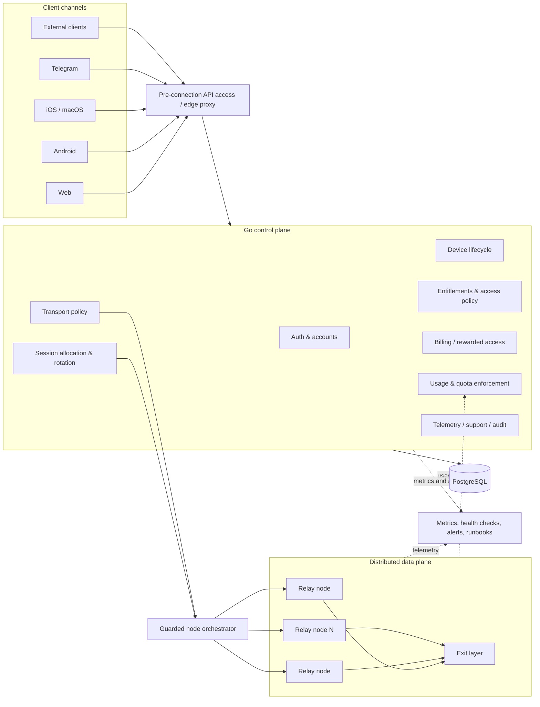
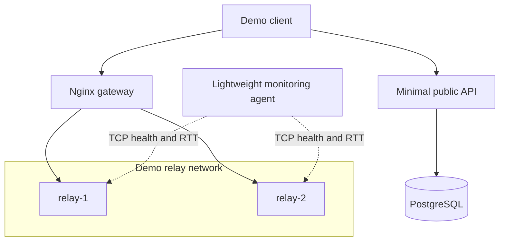
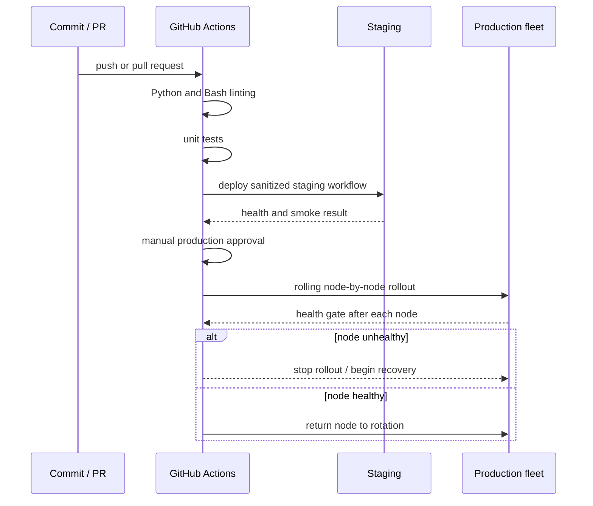

# distributed-relay-platform

A **sanitized architecture reference** for a production multi-platform network service used by **1,000+ users** across **7 infrastructure nodes** and **5 client channels**.

The real production system is built around a **Go control plane**, PostgreSQL, distributed VLESS/Xray infrastructure, account-level entitlements, device lifecycle management, usage enforcement, telemetry, and guarded node orchestration.

> **Important:** this public repository is intentionally not a source dump of the commercial system. Secrets, customer data, private domains, production hosts, billing integrations, proprietary business logic, and operational access paths are omitted. The public demo uses a minimal Python API only to make the architecture, CI/CD flow, monitoring model, and relay orchestration reproducible without exposing the private product.


## What the production platform does

The platform is more than a relay fleet. It combines product, backend, network, and operational responsibilities in one controlled system:

- authentication and account lifecycle;
- device registration, limits, and revocation;
- account-level entitlements and access capabilities;
- billing and rewarded-access flows;
- transport policy and session allocation;
- credential rotation and egress verification;
- server-side traffic accounting and quota enforcement;
- telemetry, health checks, metrics, and audit events;
- guarded orchestration of distributed relay nodes;
- shared contracts for web, Android, iOS, Telegram, and external clients.

## Production architecture



## Core engineering decisions

### One control plane for every client

Web, Android, iOS, Telegram, and external clients use shared backend contracts. Authentication, device state, entitlements, usage, and transport policy remain server-owned instead of being duplicated across clients.

### Control plane and data plane separation

The Go backend owns product state and orchestration decisions. Relay nodes execute restricted transport operations. This separates customer-facing business logic from network runtime and limits the blast radius of node-level changes.

### Server-side access and quota enforcement

Access is derived from account entitlements and server-side usage data rather than trusting local client state. Device limits, traffic quotas, session state, and capability checks are enforced centrally.

### Health-aware routing and recovery

Unhealthy nodes can be excluded from rotation. Clients and operations have explicit recovery paths, while egress verification confirms that a tunnel exits through an expected region before the connection is treated as valid.

### Guarded production changes

High-impact actions are separated by environment and role. Staging validation, feature flags, smoke evidence, manual approval, audit events, rolling deployment, health gates, and rollback reduce the risk of uncontrolled production mutations.

## Reliability and operational controls

- component-level health checks with degraded-state reporting;
- health-aware relay selection and automatic unhealthy-node exclusion;
- staged rollout before production promotion;
- rolling deployment to avoid taking the entire fleet offline;
- smoke tests and runtime evidence collection;
- explicit rollback and recovery procedures;
- telemetry, metrics, structured logs, and audit trails;
- role-separated operational access;
- human approval for high-risk production mutations;
- incident and support runbooks.

## Production vs public reference

| Area | Production system | Public repository |
|---|---|---|
| Control plane | Go backend with product and network orchestration | Minimal Python API stub |
| Data | PostgreSQL with account, device, entitlement, usage, telemetry, and operational state | Local PostgreSQL container |
| Client surface | Web, Android, iOS/macOS, Telegram, external clients | Architecture documentation only |
| Network | Distributed VLESS/Xray relay and exit infrastructure | Demo relay containers |
| Node operations | Restricted orchestration, credentials, usage export, guarded rollout | Sanitized Bash examples |
| Monitoring | Metrics agents, component health, telemetry, alerts, runbooks | Lightweight TCP/RTT monitor |
| Delivery | Staging, feature flags, smoke evidence, approval gates, rollback | GitHub Actions reference pipeline |

## Public demo topology

The runnable public version focuses on the deployment and operations contour:



## Deployment workflow



The reference GitHub Actions pipeline is:

```text
lint -> test -> deploy-staging -> manual approval -> rolling deploy-prod
```

## Repository structure

```text
distributed-relay-platform/
├── docker-compose.yml          # gateway, demo relays, API, PostgreSQL, monitoring
├── .env.example                # safe configuration template
├── Makefile                    # local lifecycle commands
├── .github/workflows/ci.yml    # lint, tests, staging, guarded production rollout
├── backend/                    # minimal public API stub
├── config/                     # sanitized gateway and Xray examples
├── monitoring/                 # TCP health, RTT, and uptime calculation example
└── scripts/
    ├── deploy.sh               # sanitized rolling-deployment workflow
    └── healthcheck.sh          # deployment health gate
```

## Run locally

```bash
cp .env.example .env
make up
make logs
make down
```

The local relay containers run in demonstration mode. They do not provide the private production service.

## What is intentionally omitted

- production source code and private business logic;
- customer and payment data;
- live hosts, domains, credentials, keys, UUIDs, and certificates;
- provider-specific billing and advertising secrets;
- production node access and privileged commands;
- internal dashboards, support tooling, and private runbooks;
- full mobile and web client implementations.

## What this repository demonstrates

- designing a shared control plane for several client platforms;
- separating product state from distributed network execution;
- health-aware routing and recovery-oriented architecture;
- server-side entitlements, usage policy, and operational boundaries;
- reproducible Docker environments;
- CI/CD with staging, approval gates, health validation, and rolling rollout;
- monitoring and operational thinking without exposing production internals.

## License

[MIT](LICENSE) © 2026 Gleb Lutfullin
