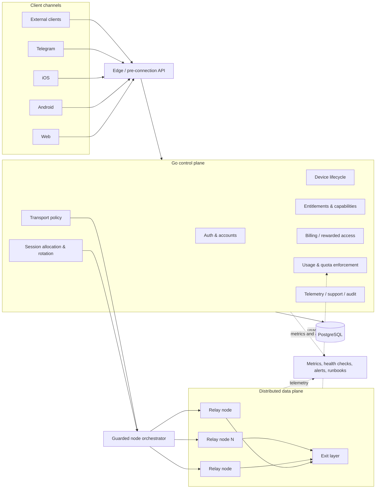
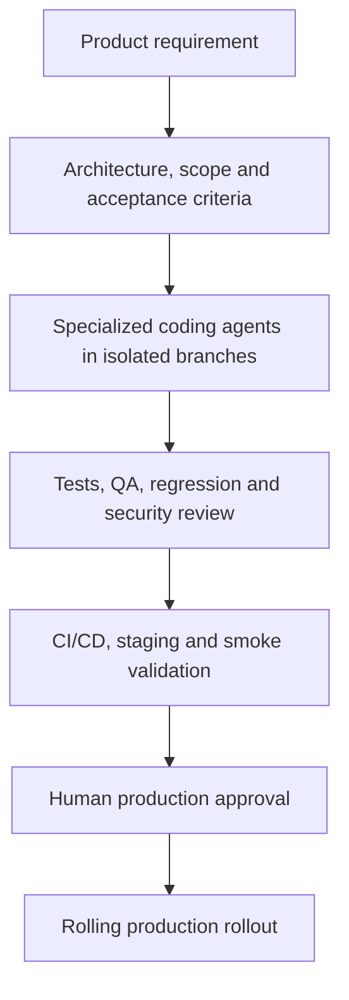
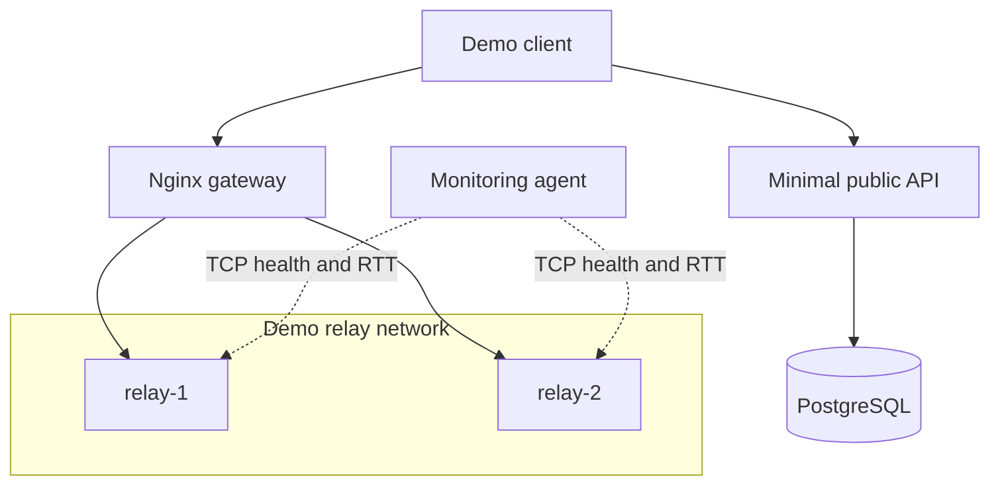
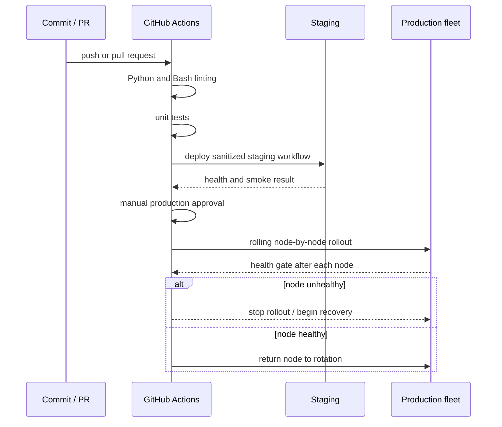

# Fortune Network Platform

## Multi-Platform Product · Go Control Plane · Distributed Infrastructure · AgentOps

A **sanitized architecture reference** for a production multi-platform network product used by **1,000+ users** across **7 infrastructure nodes** and **5 client channels**: web, Android, iOS, Telegram, and external clients.

The private production system combines mobile applications, shared backend contracts, a **Go control plane**, PostgreSQL, account and device management, entitlements, billing flows, usage enforcement, telemetry, distributed VLESS/Xray infrastructure, CI/CD, observability, and an AI-assisted engineering workflow.

> This repository is intentionally not a source dump of the commercial system. Customer data, credentials, private domains, production hosts, billing integrations, mobile source code, proprietary business logic, and operational access paths are omitted.


## Read the case study

- [Product overview](PRODUCT_OVERVIEW.md)
- [Mobile architecture and delivery](MOBILE_ARCHITECTURE.md)
- [AgentOps engineering workflow](AGENTOPS.md)
- [Detailed engineering case study](https://github.com/downmeansoff/downmeansoff/blob/main/CASE_STUDIES.md#1-fortune-network-platform--multi-platform-product-go-control-plane-and-agentops)

---

## What the product includes

The platform is more than a relay fleet. It combines product, backend, mobile, network, and operational responsibilities in one controlled system:

- Android and iOS applications;
- web and Telegram clients;
- shared versioned API contracts;
- authentication and account lifecycle;
- device registration, limits, and revocation;
- account-level entitlements and capabilities;
- billing and rewarded-access flows;
- transport policy and session allocation;
- credential rotation and egress verification;
- server-side traffic accounting and quota enforcement;
- telemetry, metrics, support metadata, and audit events;
- guarded orchestration of distributed infrastructure;
- staging, health checks, rolling deployment, and rollback;
- AgentOps for scoped implementation, QA, security review, and documentation.

## My responsibility

I led product and technical delivery across:

- product requirements, architecture, task decomposition, and acceptance criteria;
- Android and iOS delivery coordination;
- shared backend contracts and PostgreSQL data models;
- authentication, device lifecycle, entitlements, usage policy, and transport sessions;
- infrastructure topology, monitoring, incident readiness, rollout, and rollback;
- release preparation and production validation;
- AI-assisted implementation, test generation, regression checks, security review, and documentation.

My role combined product ownership, architecture, engineering coordination, and operational reliability.

---

## Production architecture



## Production control plane

The private Go backend coordinates:

- guest, email OTP, Apple, and Google authentication;
- account and device lifecycle;
- account-level entitlements and client capabilities;
- billing and rewarded-access flows;
- region and transport policy publication;
- transport session allocation, rotation, and revocation;
- server-side usage accounting and quota enforcement;
- telemetry, support metadata, metrics, and audit events;
- guarded orchestration of distributed relay nodes.

The network data plane is separated from product state. Restricted node operations apply transport credentials and export usage data, while the control plane remains the source of truth for users, devices, access decisions, and recovery semantics.

---

## Core engineering decisions

### One control plane for every client

Web, Android, iOS, Telegram, and external clients use shared backend contracts. Authentication, device state, entitlements, usage, and transport policy remain server-owned instead of being duplicated across clients.

### Control-plane and data-plane separation

The Go backend owns product state and orchestration decisions. Relay nodes execute restricted transport operations. This limits the blast radius of node-level changes and separates customer-facing business logic from network runtime.

### Server-side access and quota enforcement

Access is derived from account entitlements and server-side usage data rather than trusting local client state. Device limits, quotas, session state, and capability checks are enforced centrally.

### Health-aware routing and recovery

Unhealthy nodes can be excluded from rotation. Clients and operations have explicit recovery paths, while egress verification confirms that a connection exits through an expected region before it is treated as valid.

### Versioned contracts

Backend and clients use versioned status, error, and recovery contracts. Mixed client versions are easier to support, and runtime failures are easier to diagnose and reproduce.

### Guarded production changes

High-impact actions are separated by environment and role. Staging validation, feature flags, smoke evidence, manual approval, audit events, rolling deployment, health gates, and rollback reduce the risk of uncontrolled production mutations.

---

## Reliability and operational controls

- component-level health checks with degraded-state reporting;
- health-aware relay selection and automatic unhealthy-node exclusion;
- egress verification;
- staged rollout before production promotion;
- rolling deployment to avoid taking the fleet offline;
- smoke tests and runtime evidence collection;
- explicit rollback and recovery procedures;
- telemetry, metrics, structured logs, and audit trails;
- role-separated operational access;
- human approval for high-risk production mutations;
- incident and support runbooks.

---

## AgentOps workflow



Coding agents assist with repository analysis, scoped implementation, test generation, regression checks, documentation, and security review. Architecture, production permissions, release boundaries, and high-impact decisions remain human-controlled.

[Read the full AgentOps model →](AGENTOPS.md)

---

## Production vs public reference

| Area | Production system | Public repository |
|---|---|---|
| Control plane | Go backend with product and network orchestration | Minimal Python API stub |
| Data | PostgreSQL with account, device, entitlement, usage, telemetry, and operational state | Local PostgreSQL container |
| Client surface | Web, Android, iOS, Telegram, external clients | Architecture documentation |
| Network | Distributed VLESS/Xray relay and exit infrastructure | Demo relay containers |
| Node operations | Restricted orchestration, credentials, usage export, guarded rollout | Sanitized Bash examples |
| Monitoring | Metrics agents, component health, telemetry, alerts, runbooks | Lightweight TCP/RTT monitor |
| Delivery | Staging, feature flags, smoke evidence, approval gates, rollback | GitHub Actions reference pipeline |
| AgentOps | Private agent roles, prompts, and repository workflows | Public process and safety model |

---

## Runnable public demo

The public implementation focuses on the deployment and operations contour:



### Deployment workflow



The reference pipeline is:

```text
lint -> test -> deploy-staging -> manual approval -> rolling deploy-prod
```

## Repository structure

```text
distributed-relay-platform/
├── README.md
├── PRODUCT_OVERVIEW.md
├── MOBILE_ARCHITECTURE.md
├── AGENTOPS.md
├── docker-compose.yml
├── .env.example
├── Makefile
├── .github/workflows/ci.yml
├── backend/
├── config/
├── monitoring/
└── scripts/
    ├── deploy.sh
    └── healthcheck.sh
```

## Run locally

```bash
cp .env.example .env
make up
make logs
make down
```

The local relay containers run in demonstration mode. They do not provide the private production service.

## What is intentionally omitted

- production source code and proprietary business logic;
- customer and payment data;
- live hosts, domains, credentials, keys, UUIDs, and certificates;
- provider-specific billing and advertising secrets;
- production node access and privileged commands;
- private agent prompts and internal automation;
- full mobile and web client implementations;
- internal dashboards, support tooling, and private runbooks.

## What this repository demonstrates

- end-to-end product and platform architecture;
- coordination across mobile, backend, infrastructure, and operations;
- one shared control plane for several client platforms;
- separation of product state from distributed network execution;
- health-aware routing and recovery-oriented architecture;
- server-side entitlements, usage policy, and operational boundaries;
- reproducible Docker environments;
- CI/CD with staging, approval gates, health validation, and rolling rollout;
- controlled AgentOps without unrestricted production access.

## License

[MIT](LICENSE) © 2026 Gleb Lutfullin
