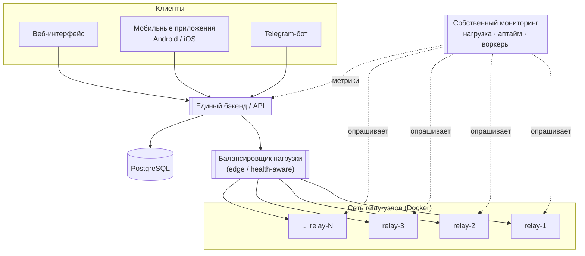

# distributed-relay-platform

Обезличенный референс инфраструктуры распределённой сетевой платформы, которую я
спроектировал и держу в проде: балансировка нагрузки на сеть relay-узлов, единый
бэкенд с общим API, CI/CD со staging-окружением и собственная система мониторинга.

> **Про этот репозиторий.** Это *санитизированная портфолио-версия* реального
> продакшн-сервиса. Секреты, ключи, домены и код бизнес-логики сюда не входят — их
> заменяют примеры (`*.example`) и заглушки. Задача репозитория — показать
> архитектуру и DevOps-практики, а не поднять сервис «из коробки».


## Архитектура



**Ключевые решения**

- **Один API на все клиенты.** Веб, мобильные приложения и Telegram-бот ходят в
  единый бэкенд через общий контракт — меньше дублирования логики, проще выкатки.
- **Балансировка с учётом здоровья узлов.** Трафик не льётся на relay, который не
  прошёл health-check; узел выводится из ротации до восстановления.
- **Собственный мониторинг вместо готового.** Лёгкий агент собирает нагрузку,
  аптайм и состояние воркеров с каждого узла — полный контроль над тем, что и как
  измеряется, без тяжёлого стека.
- **CI/CD со staging.** Изменения сначала едут на stage-узлы, прогоняются проверки,
  и только потом — в прод. Деплой без даунтайма (rolling).

## Стек

| Слой            | Технологии                                          |
|-----------------|-----------------------------------------------------|
| Оркестрация     | Docker, Docker Compose                              |
| Edge / relay    | Xray (VLESS), health-aware балансировка             |
| Бэкенд / API    | Python                                              |
| Хранилище       | PostgreSQL                                          |
| CI/CD           | GitHub Actions (lint → test → staging → prod)       |
| Наблюдаемость   | Собственный агент мониторинга (Python)              |
| Скрипты / ops   | Bash                                                |

## Структура репозитория

```
distributed-relay-platform/
├── docker-compose.yml         # локальная сборка: LB + relay-узлы + backend + monitoring
├── .env.example               # переменные окружения (без реальных значений)
├── Makefile                   # частые команды: up / down / logs / lint / deploy
├── .github/workflows/ci.yml   # пайплайн: lint → test → deploy staging → deploy prod
├── backend/                   # заглушка единого API
│   ├── app.py
│   └── requirements.txt
├── config/xray/
│   └── relay.example.json     # пример конфигурации relay-узла (санитизировано)
├── monitoring/
│   ├── monitor.py             # агент: аптайм, нагрузка, состояние воркеров
│   └── README.md
└── scripts/
    ├── deploy.sh              # rolling-деплой на узлы по SSH
    └── healthcheck.sh         # проверка здоровья узла для балансировщика
```

## Как запустить локально

```bash
cp .env.example .env      # заполнить примерными значениями
make up                   # поднять стенд в Docker
make logs                 # смотреть логи
make down                 # остановить
```

> Для локального стенда relay-узлы работают в демо-режиме (без реального проксирования).

## CI/CD

Пайплайн в `.github/workflows/ci.yml`:

1. **lint** — проверка Python (`ruff`) и Bash (`shellcheck`);
2. **test** — юнит-тесты бэкенда и агента мониторинга;
3. **deploy-staging** — выкатка на stage-узлы, smoke-проверки;
4. **deploy-prod** — ручное подтверждение (environment protection) → rolling-деплой.

## Лицензия

[MIT](LICENSE) © 2026 Глеб Лутфуллин
